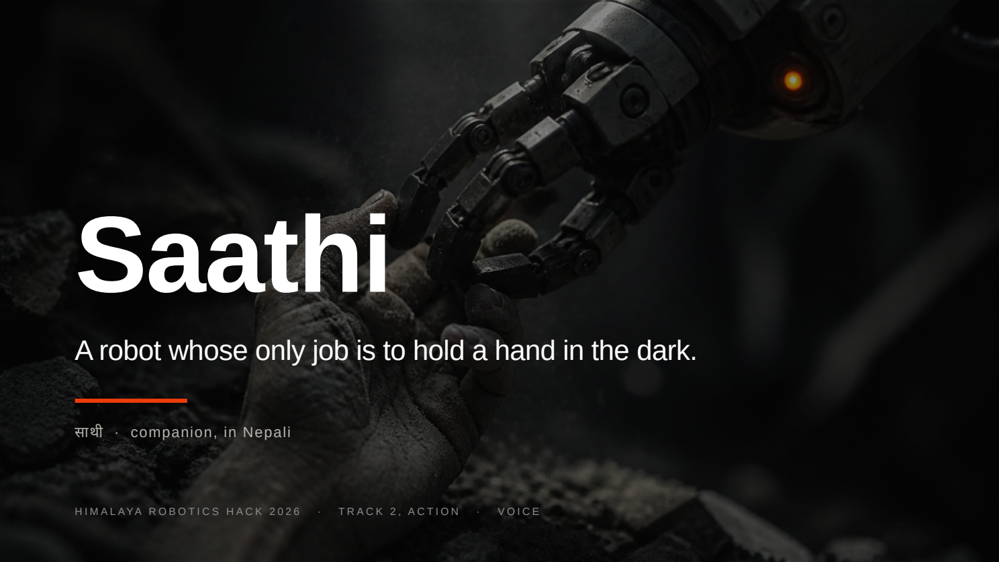
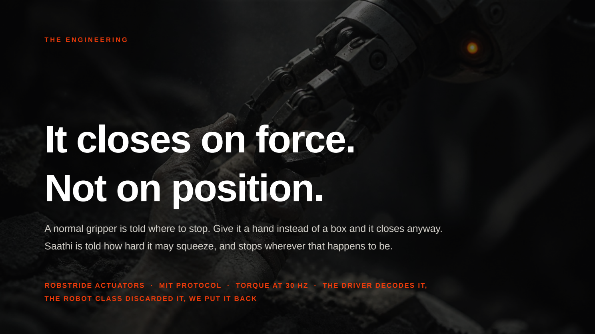
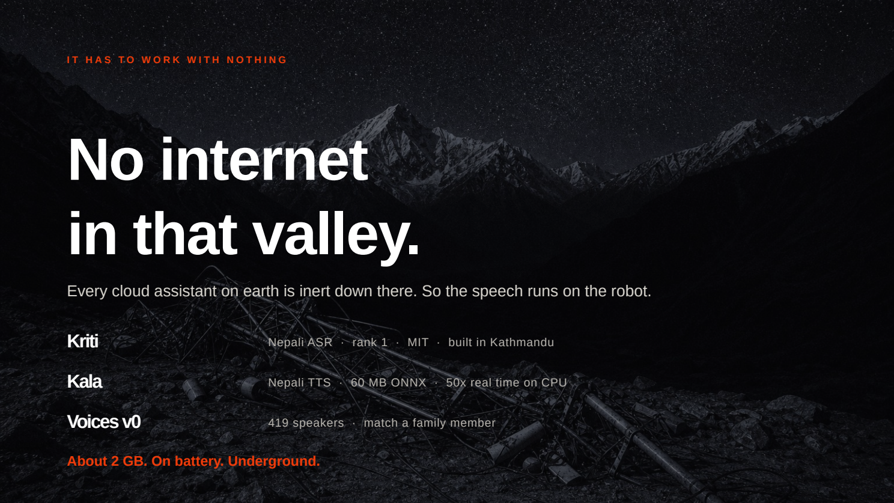
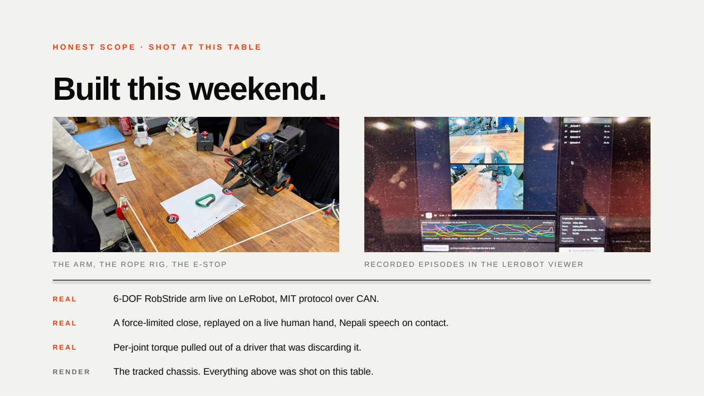

<div align="center">

```
   ██████  ▄▄▄       ▄▄▄     ▄▄▄█████▓ ██░ ██  ██▓
 ▒██    ▒ ▒████▄    ▒████▄   ▓  ██▒ ▓▒▓██░ ██▒▓██▒
 ░ ▓██▄   ▒██  ▀█▄  ▒██  ▀█▄ ▒ ▓██░ ▒░▒██▀▀██░▒██▒
   ▒   ██▒░██▄▄▄▄██ ░██▄▄▄▄██░ ▓██▓ ░ ░▓█ ░██ ░██░
 ▒██████▒▒ ▓█   ▓██▒ ▓█   ▓██▒ ▒██▒ ░ ░▓█▒░██▓░██░
 ▒ ▒▓▒ ▒ ░ ▒▒   ▓▒█░ ▒▒   ▓▒█░ ▒ ░░    ▒ ░░▒░▒░▓  
 ░ ░▒  ░ ░  ▒   ▒▒ ░  ▒   ▒▒ ░   ░     ▒ ░▒░ ░ ▒ ░
 ░  ░  ░    ░   ▒     ░   ▒    ░       ░  ░░ ░ ▒ ░
       ░        ░  ░      ░  ░         ░  ░  ░ ░  
```

### **A robot whose only job is to hold a hand in the dark.**

**साथी** · *companion, in Nepali*

`HIMALAYA ROBOTICS HACK 2026` · `TRACK 2 — ACTION` · `VOICE CHALLENGE`

<br>

> ### *It doesn't dig. It doesn't lift. It stays.*

<br>

[**The Deck**](deck/Saathi.pdf) · [**Pitch Script**](docs/PITCH.md) · [**Demo Video**](#-demo) · [**Run It**](#-run-it)

</div>

---

```
                                    ╭─────────────────╮
    ▓▓▓▓▓▓▓▓▓▓▓▓▓▓▓▓▓▓▓▓▓▓▓▓▓▓▓▓▓  │  "ma yahaa chu" │
    ▓▓  R U B B L E  ▓▓▓▓▓▓▓▓▓▓▓▓  │   I am here.    │
    ▓▓▓▓▓▓▓▓▓▓▓╱────────╲▓▓▓▓▓▓▓▓  ╰────────┬────────╯
    ▓▓▓▓▓▓▓▓▓╱            ╲▓▓▓▓▓▓           │
    ▓▓▓▓▓▓▓ │   ╭──────╮   │ ▓▓▓▓▓▓         │
    ▓▓▓▓▓▓  │  ╭┤ HAND ├╮  │  ▓▓▓▓▓  ◀══════╯
    ▓▓▓▓▓   │  ╰┴──────┴╯  │   ▓▓▓▓
    ▓▓▓▓    ╲   ╱══════╲   ╱    ▓▓▓   ← force-limited grip
    ▓▓▓▓▓▓▓▓▓╲═╱        ╲═╱▓▓▓▓▓▓▓▓
    ▓▓▓▓▓▓▓▓▓▓▓          ▓▓▓▓▓▓▓▓▓▓      tether ═══════▶ surface
```

## What happened

On **26 August 2026**, a 600-metre section of glacier and bedrock sheared off at 5,200 m in **Rasuwa, Nepal**, and fell **1,200 metres** into the Lhende valley. It dammed the river. The dam burst.

<div align="center">

| `669` | `2,900` | `93,000` | `42 km` |
|:---:|:---:|:---:|:---:|
| **CONFIRMED DEAD** | **STILL MISSING** | **AFFECTED** | **OF ROAD, EVERY BRIDGE** |

</div>

Fourteen hydropower plants are down, with workers unaccounted for inside flooded intake tunnels. Nepal publicly asked for foreign technical help with **two things: tunnel rescue, and identifying the dead.**

## The gap nothing occupies

```
 ┌──────────────────────────────────────────────────────────────────┐
 │                                                                  │
 │   THE WARNING IS MINUTES.          THE RESCUE IS HOURS.          │
 │   ▓▓                               ░░░░░░░░░░░░░░░░░░░░░░░░░░░   │
 │                                                                  │
 │                    └──────── this gap ────────┘                  │
 │                     nothing currently occupies it                │
 │                     except a volunteer in the dirt               │
 └──────────────────────────────────────────────────────────────────┘
```

People trapped in rubble **do not primarily die of injury.** They die of shock, dehydration, crush syndrome on extraction — and of giving up.

This is why search-and-rescue doctrine puts a voice in contact with a trapped person and keeps it there *continuously*, before any lifting begins.

Today that is a human being lying face down in silt with one arm through a gap, for as long as the excavation takes. That job:

- **does not scale** — one rescuer, one hole, six hours
- **cannot enter** a space a shoulder will not pass
- **must be abandoned** the moment the barrier lakes upstream begin to move

Two such lakes above the valley are still filling. One breached its banks on 28 August and suspended the rescue.

## What Saathi does

Three things, and nothing else. **Company, not a crane.**

```
   ╔═══════════╗   ╔═══════════╗   ╔═══════════╗   ╔═══════════╗
   ║   HOLD    ║   ║  SUSTAIN  ║   ║   SPEAK   ║   ║   MARK    ║
   ╠═══════════╣   ╠═══════════╣   ╠═══════════╣   ╠═══════════╣
   ║ Closes on ║   ║ Water,    ║   ║ Nepali,   ║   ║ Records   ║
   ║ force,    ║   ║ light,air ║   ║ generated ║   ║ the place.║
   ║ not on    ║   ║ down the  ║   ║ on the    ║   ║ Moves     ║
   ║ position. ║   ║ tether.   ║   ║ device.   ║   ║ nothing.  ║
   ╚═══════════╝   ╚═══════════╝   ╚═══════════╝   ╚═══════════╝
        One hand. Four jobs. All of them contact.
```

## The engineering

### It closes on force. Not on position.

A normal gripper is told **where to stop.** Give it a hand instead of a box and it closes anyway.

Saathi is told **how hard it may squeeze**, and stops wherever that happens to be.

```
   POSITION CONTROL                    FORCE CONTROL
   ────────────────                    ─────────────
   "close to 20mm"                     "close until 60 units of resistance"
        │                                   │
        ▼                                   ▼
   ┌─────────┐                         ┌─────────┐
   │ ▓▓▓▓▓▓▓ │  ← goes to 20mm         │ ░░░░░░░ │  ← stops at contact
   │ ▓▓▓▓▓▓▓ │    whatever is          │ ░░░░░░░ │    wherever that is
   └─────────┘    in the way           └─────────┘
     ✗ CRUSH                             ✓ HOLD
```

> **The enabling detail.** The RobStride actuators report per-joint torque in every MIT-protocol feedback frame at 30 Hz, and the driver already decodes it — `robstride.py` returns `position, velocity, torque, temperature`. The follower robot class then **discards it**: its observation dict contains joint positions and camera frames only.
>
> We put it back. That is the entire reason a force-limited grip is possible, and the only reason it is safe to close on a person.

`ROBSTRIDE ACTUATORS` · `MIT PROTOCOL` · `TORQUE AT 30 HZ` · `THE DRIVER DECODES IT, THE ROBOT CLASS DISCARDED IT, WE PUT IT BACK`

### The hold loop

```
   OPEN ──▶ closing ──▶ [load ≥ threshold ×3 ticks] ──▶ HOLD ──▶ speak
                              │                           │
                              │                           ▼
                              │                    [load drops ×3 ticks]
                              ▼                           │
                        no hand found                     ▼
                              │                     they let go
                              └──────▶ REOPEN ◀───────────┘
```

Three consecutive ticks at 30 Hz (~100 ms) before any state change is believed — enough to reject single-frame serial noise without making the grip feel laggy to the person being held.

## Why speech runs on the device

**There is no network in that valley.** The towers went with the valley floor, along with the roads, the bridges, and a 220 kV substation. Every cloud assistant on earth is inert at the bottom of a collapsed building.

<div align="center">

| Model | Role | Detail |
|:---|:---|:---|
| **Kriti** | Nepali ASR | rank 1 · MIT licence · built in Kathmandu |
| **Kala** | Nepali TTS | 60 MB ONNX · 50× real time on CPU |
| **Voices v0** | Speaker match | 419 speakers · match a family member |

**≈ 2 GB. On battery. Underground.**

</div>

### What it says

Short lines, because someone under rubble is in pain and frightened and cannot follow sentences.

| Romanised | English |
|:---|:---|
| `ma yahaa chu` | I am here. |
| `uddhaar aayirakheko chha` | Rescue is coming. |
| `mero haat chhod-nu-hos na` | Do not let go of my hand. |
| `saas pheri rahanuhos` | Keep breathing. |
| `timi eklai chhainau` | You are not alone. |

## Why it is on a wire

**Radio does not pass through rubble.** So the cable is the product — power in, so it never dies mid-hold; voices in and out, so a doctor in Kathmandu can reach the bottom of the hole.

## Mark

> Rasuwa is Tamang and Buddhist. Downstream is Hindu. The rites differ at each end of the same river, and **neither is ours to perform.** So it records the position, moves nothing, and leaves a marker so the family and the right people can find the place.

---

## 🎬 Demo

> *Demo link to be added.*

---

## 🚀 Run it

No hardware required for the logic — the hold loop and voice loop need **nothing outside the standard library.**

```bash
git clone https://github.com/abhinxx/saathi-robot
cd saathi-robot

# Verify the hold logic (assertions, no hardware)
python3 -m saathi.hold --self-check

# Verify the voice loop
python3 -m saathi.voice

# Simulated hand, full loop, no robot attached
python3 -m saathi.hold --dry-run
```

<details>
<summary><b>Expected output</b></summary>

```
$ python3 -m saathi.hold --self-check
self-check ok

$ python3 -m saathi.voice
[saathi] ma yahaa chu  (I am here.)
[saathi] uddhaar aayirakheko chha  (Rescue is coming.)
[saathi] mero haat chhod-nu-hos na  (Do not let go of my hand.)
[saathi] saas pheri rahanuhos  (Keep breathing.)
self-check ok
```

</details>

### Against real hardware

```bash
pip install -r requirements.txt          # lerobot >= 0.6.0, Python 3.10+

python3 -m saathi.hold \
  --port /dev/tty.usbmodemXXXXXXX \
  --id saathi \
  --seconds 20
```

| Flag | Default | Meaning |
|:---|:---|:---|
| `--dry-run` | off | simulated hand, no hardware |
| `--self-check` | off | run assertions and exit |
| `--port` | `/dev/tty.usbmodem58FA0829721` | follower arm serial port |
| `--id` | `saathi` | robot id for calibration lookup |
| `--seconds` | `20.0` | hold duration |
| `--quiet` | off | do not speak on contact |

### Tuning the grip

Constants live at the top of [`saathi/hold.py`](saathi/hold.py):

```python
OPEN_POSITION  = 60.0   # gripper open, normalised 0-100
CONTACT_LOAD   = 60.0   # Present_Load threshold — deliberately low
RELEASE_LOAD   = 20.0   # below this, the hand withdrew
CLOSE_STEP     = 1.5    # normalised units per tick
TICK_HZ        = 30.0
DEBOUNCE_TICKS = 3      # ~100 ms before a state change is believed
```

> `CONTACT_LOAD` is deliberately low. **Squeezing a hand is a failure, not a success.**

---

## 📁 Repository

```
saathi-robot/
├── saathi/
│   ├── hold.py            force-limited hold loop + simulated gripper + self-check
│   └── voice.py           threaded Nepali reassurance loop
├── phrases/               pre-recorded Nepali audio (.wav, named after romanised line)
├── deck/
│   ├── Saathi.pdf         the pitch deck
│   ├── Saathi.pptx        editable source
│   ├── build_deck.py      generates the deck
│   └── slides/            s01–s15 rendered PNGs
├── docs/
│   ├── PITCH.md           pitch script, submission text, Q&A prep
│   └── VIDEO.md           2-minute demo shot list
└── requirements.txt
```

---

## 🎯 Honest scope

**Shot at this table. Built this weekend.**

<div align="center">

| | Component |
|:---:|:---|
| ✅ **REAL** | 6-DOF RobStride arm live on LeRobot, MIT protocol over CAN |
| ✅ **REAL** | A force-limited close, replayed on a live human hand, Nepali speech on contact |
| ✅ **REAL** | Per-joint torque pulled out of a driver that was discarding it |
| ⬜ **RENDER** | The tracked chassis |

</div>

Everything marked REAL was shot on this table. Three further limitations, stated before anyone asks:

- **The chassis does not exist.** This is the hand.
- **Current arm hardware is far too heavy** for the deployed form factor. The real version needs hardware that does not exist yet.
- **The hold is a replayed recorded motion gated on a force threshold**, not a learned policy. That is deliberate — a deployment motion should be deterministic, and the part that needs to be intelligent is *when to stop closing.*

---

## 📊 The deck

<div align="center">

 
 

[**→ Full deck (PDF)**](deck/Saathi.pdf) · [**→ All 15 slides**](deck/slides)

</div>

<details>
<summary><b>Slide-by-slide</b></summary>

| # | Slide |
|:---:|:---|
| 01 | **Saathi** — a robot whose only job is to hold a hand in the dark |
| 02 | Why this one — *part of my family is from these mountains* |
| 03 | Rasuwa, Nepal · 26 August 2026 — a glacier fell 1,200 metres |
| 04 | Four days later — 669 dead, 2,900 missing, 93,000 affected, 42 km of road |
| 05 | The gap nothing occupies — the warning is minutes, the rescue is hours |
| 06 | What actually kills them — they do not die of injury, they die alone |
| 07 | Introducing Saathi — company, not a crane |
| 08 | What the hand is for — HOLD · SUSTAIN · SPEAK · MARK |
| 09 | The engineering — it closes on force, not on position |
| 10 | It has to work with nothing — no internet in that valley |
| 11 | Why it is on a wire — radio does not pass through rubble |
| 12 | Sustain — the hold is why they keep answering |
| 13 | Mark — sometimes it arrives too late |
| 14 | Honest scope — shot at this table |
| 15 | **It stays.** साथी · no one waits alone |

</details>

---

## 📚 Sources

Reuters, Kathmandu Post, Al Jazeera, The Guardian, ReliefWeb and IFRC reporting, 26–29 August 2026. USGS initially logged the event as a magnitude 4.4 earthquake and later revised it to a magnitude 5.2 glacial collapse.

Built on [LeRobot](https://github.com/huggingface/lerobot) · [Himalaya Robotics Hack](https://www.livekit.info/himalaya-robotics-hack)

---

<div align="center">

```
                    ╭──────────────────────────╮
                    │                          │
                    │       It stays.          │
                    │                          │
                    │  साथी  ·  Saathi         │
                    │  no one waits alone      │
                    │                          │
                    ╰──────────────────────────╯
```

</div>
